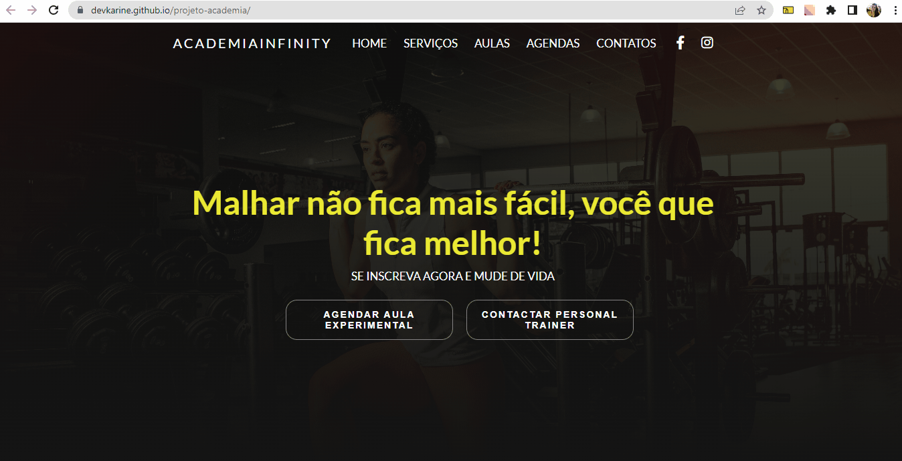

# Projeto Academia Landing Page

## Aprendizados nesse projeto
   O objetivo é continuar treinando e aprofundando meu aprendizado em html e css, com esse projeto aprendi novas formas de usar o hover e me aperfeiçoar na resposividade.

## Meu Processo

    •	Marcação semântica HTML5
    •	Propriedades personalizadas de CSS3
    •	Flexbox  
    •	Design responsivo

## Design

### Desktop e Responsivo

## Autor

 GitHub: <a href="https://github.com/devkarine">DevKarine</a>  
FrontEndMentor: <a href="https://www.frontendmentor.io/profile/devkarine">@devkarine</a>  
CodePen: <a href="https://codepen.io/devkarine">DevKarine</a>  
LinkedIn: <a href="https://www.linkedin.com/in/devkarine/">Karine Pereira</a>